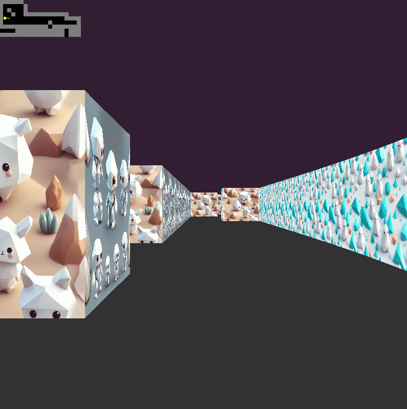

# cub3D 🎮
*A 42 School project recreating Wolfenstein 3D-style raycasting in C*

## Project Description ✨
**cub3D** is a minimalist 3D raycasting engine inspired by *Wolfenstein 3D*.  
Built from scratch in **C** using **MiniLibX**, it transforms 2D maps into interactive 3D environments through mathematical rendering.

**🛠️ Technical Highlights**  
- **Raycasting engine** using DDA algorithm  
- **Dynamic rendering** of textured walls/floors  
- **Smooth controls**: WASD + mouse look  
- **Configurable maps** via `.cub` files  
- **Optimized** for 60+ FPS  

## 📥 Installation

### **Prerequisites**
- **Linux/WSL2** (or macOS with X11)
- **MiniLibX** (included in the repo)
- **C Compliler(`cc`/`gcc`/`clang`)**
- **GNU Make**

### Install Dependencies
#### For Debian/Ubuntu:
```bash
sudo apt-get install gcc make xorg libxext-dev libbsd-dev
```
#### For macOS (if using the macOS version of MinilibX):
```bash
brew install libx11
```
### Download VcXsrv
Open `PowerShell` as Administrator. Use the `command`:
```powershell
Invoke-WebRequest -Uri "https://netcologne.dl.sourceforge.net/project/vcxsrv/vcxsrv/1.20.14.0/vcxsrv-64.1.20.14.0.installer.exe" -OutFile "$env:USERPROFILE\Downloads\vcxsrv-installer.exe"
```
### Install VcXsrv
Use the `command`:
```powershell
Start-Process -Wait -FilePath "$env:USERPROFILE\Downloads\vcxsrv-installer.exe" -ArgumentList "/S"
```
### **After Installation**
#### **1, Open XLaunch**
- Set display srttings to `Multiple windows`  
- Start with no client  
- Tick `disable access control`  
- Finish  
##### **2, Look for IPV4 address**
In `powershell` use the `command`:
```powershell
ipconfig
```
#### **3, Set environment variable "DISPLAY"**
In `bash` use the `command`:
```bash
export DISPLAY=[IP_ADDRESS]:0 >> ~/.bashrc
```

## Compilation

### **1. Clone and compile the repository**
```bash
git clone https://github.com/mtelek/cub3D.git
cd cub3D
make
```
Executable will be named `cub3D`.

## 🕹️ Usage
Run the Game:
```bash
./cub3D test.cub
```
Test.cub can be replacedd with a custom map file.
In all cases it should end with `.cub`.

### Controls
- `W` `A` `S` `D`: Move forward/backward/strafe
- `←` `→`: Rotate camera
- `ESC`: Quit game

## Map File Formating
Example:
```bash
NO textures/wall_north.xpm  # North texture
SO textures/wall_south.xpm  # South texture
WE textures/wall_west.xpm   # West texture
EA textures/wall_east.xpm   # East texture
F 220,100,0                 # Floor color (RGB)
C 135,206,235               # Ceiling color (RGB)

1111111111111               # Map (1=wall, 0=empty)
1000000000001               # Player: N/S/E/W for spawn
1111111111111
```

## Credits
- The project uses [MiniLibX](https://github.com/42Paris/minilibx-linux) by École 42 (BSD 2-Clause License).  
  
## Picture of the game
